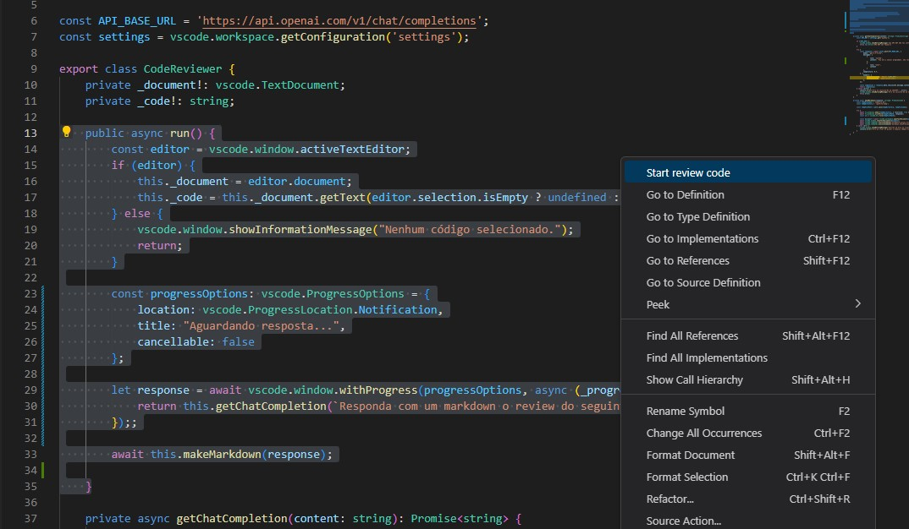

# CodeReviewer

A extensão CodeReviewer é uma ferramenta que permite revisar código utilizando o poder do modelo de linguagem GPT-3.5 Turbo da OpenAI. Com esta extensão, você pode obter análises e feedbacks detalhados sobre o código selecionado.

## Funcionalidades

- Solicita uma revisão de código com base em princípios de programação SOLID e clean code.
- Gera um arquivo Markdown com o feedback da revisão do código.
- Exibe uma visualização em tempo real do arquivo Markdown gerado.

## Como usar

**Não esqueça de configurar a chave apiKey em 'Extension Settings'**

### Opção 1: Comando

1. Selecione o código que deseja revisar no editor do Visual Studio Code.
2. Abra o Command Palette (Ctrl/Cmd + Shift + P) e pesquise por "Start review code".
3. Selecione a opção "Start review code" para iniciar o processo de revisão.
4. Aguarde a resposta do serviço de revisão de código.
5. Após a conclusão, um arquivo Markdown com o feedback da revisão será aberto em uma visualização separada.
6. Você pode salvar o arquivo Markdown e compartilhá-lo conforme necessário.

### Opção 2: Menu de contexto

1. Selecione o código que deseja revisar no editor do Visual Studio Code.
2. Clique com o botão direito do mouse no código selecionado.
3. No menu de contexto exibido, clique na opção "Review code" para iniciar o processo de revisão.
4. Aguarde a resposta do serviço de revisão de código.
5. Após a conclusão, um arquivo Markdown com o feedback da revisão será aberto em uma visualização separada.
6. Você pode salvar o arquivo Markdown e compartilhá-lo conforme necessário.

## Configurações

- `settings.apiKey`: A chave de API gerada no chat GPT da OpenAI. [Obtenha uma chave aqui](https://platform.openai.com/account/api-keys).

## Como contribuir

- Faça o fork deste repositório.
- Crie uma branch com a sua feature: `git checkout -b feat/minha-feature`.
- Faça commit das suas alterações: `git commit -m 'feat: Adiciona minha feature'`.
- Faça push para a branch: `git push origin feat/minha-feature`.
- Abra um pull request.

## Licença

MIT License
